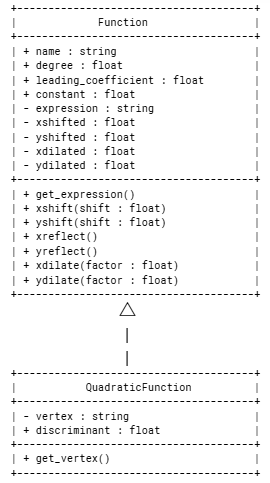
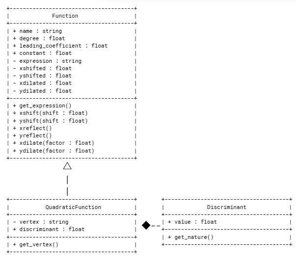
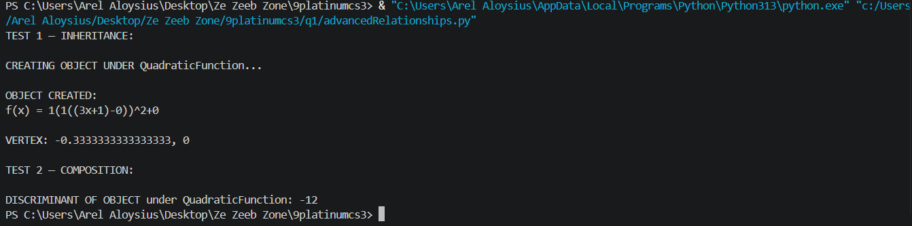
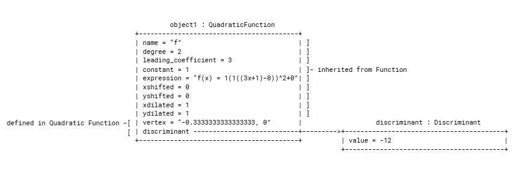

# Advanced Class Relationships

## Previous Activities

[classAttrib](classAttributesMethods.md)

[classRel](classRelationships.md)

## Existing System Description:

Class 1: Function
Class 2: CartesianPlane

Limitation/s:
-unused attributes and methods

The many attributes and methods of objects under class Function thus far have not been fully utilized.

## Inheritence Relationship

Parent: Function

Child: QuadraticFunction

Explanation: A quadratic function is still a function, with each x-value only having at most one y-value. It is different from other functions in that its degree is exactly two.

## Inheritence UML

## Composition/Aggregation

Relationship: Composition
Class containing another object: Function
Contained object: QuadraticFunction

Explanation: A quadratic function is still qualified to be a function and thus is removed when functions too are removed.

## Advanced UML Diagram

## Python Implementation

[Source Code](advancedRelationships.py)

## Test Run

## Object Diagram

## Reflection

1. Why did you choose your inheritance relationship? Explain why your child class is a type of your parent class.

Quadratic functions are a specific type of functions, what makes them special being that they are polynomials each with a degree of two. Thus, QuadraticFunction is the child class under parent class Function.

2. How did inheritance reduce duplicate code? Identify attributes or methods that were reused.

Inheritance reduced duplicate code by getting rid of the need to manually copy and paste the attributes and methods of a parent class into a child class, using "super()". The attributes reused were name, degree, leading_coefficient, constant, xshifted, yshifted, xdilated, ydilated, and expression.

3. Why is your HAS-A relationship Composition or Aggregation? Explain the lifecycle relationship between the two objects.

It is composition since quadratic functions are a type of functions that thus cannot exist when functions do not exist.

4. What is the difference between Association from Part III and the advanced relationship you
implemented?

In association, two classes are independent of each other though interact with each other; thus, one can still exist without the other. As for the advanced relationship I implemented, once the whole class no longer exists, its subclass or child class too doesn't exist.

5. How does your design follow the DRY principle?

I use "super()" to no longer have to copy and paste manually the attributes of the parent class Function into child class QuadraticFunction. Thus, I avoid repeating myself whenever I don't have to.