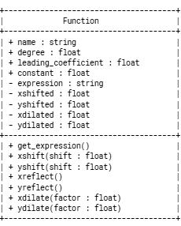
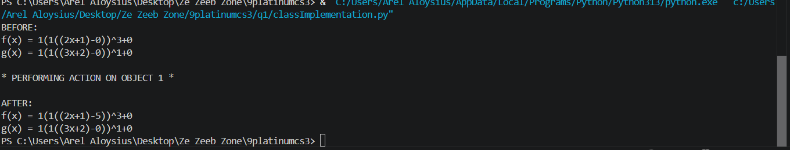
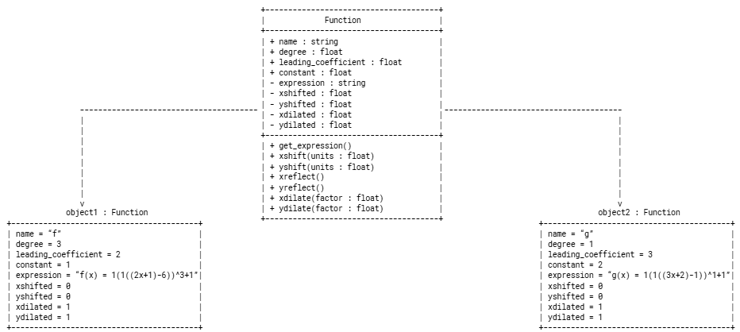

# Class Attributes and Methods

## Previous Design
Link to my previous activity:
[classObjectUML.md](classObjectUML.md)

## Design Revision
Changes from my previous design:
- Addition of attributes "expression," "xshifted," "yshifted," "xdilated," and "ydilated"
- Addition of method "get_expression"
- Replacement of methods "xstretch," "ystretch," "xcompress," and "ycompress" with "xdilate" and "ydilate"
- Changed the parameters of xshift and yshift from "units" to "shift"

## Visibility Decisions
| Attributes | Data Type | Visibility | Reason |
|---|---|---|---|
|name|string|public|already initialized.|
|degree|float|public|already initialized.|
|leading_coefficient|float|public|already initialized.|
|constant|float|public|already initialized.|
|expression|string|private|prone to changes via methods.|
|xshifted|float|private|prone to changes via methods.|
|yshifted|float|private|prone to changes via methods.|
|xdilated|float|private|prone to changes via methods.|
|ydilated|float|private|prone to changes via methods.|

## Updated UML Class Diagram

## Python Implementation
[View Python Source](classImplementation.py)

## Analysis

### Why did you make your chosen attribute private?
The decision that the chosen attributes would be turned private is so that only the methods responsible for changing the objects' states can change their values. The data fields name, degree, leading_coefficient, and constant are all given as an object is initiated and are not changed for the remainder of the code.

### Which method changes the state of your object?
The methods that change the state of the object are xshift(shift), yshift(shift), xreflect(), yreflect(), xdilate(factor), and ydilate(factor). The method get_expression() simply returns expression.

### How did your two objects demonstrate that instances are independent?
As a method was performed on object1, only object1 was affected whereas object2 was left unaffected, thus exhibiting encapsulation.

### What is the difference between your class diagram and your object diagram?
The class diagram displays the class template itself, including the data types of the data fields and whether they are public or private. The object diagram displays instances of the class, showing the data field values of each of the class's objects. 