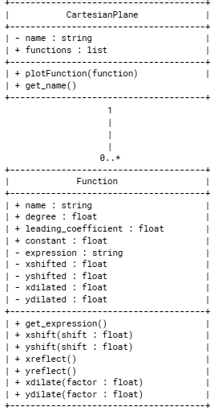
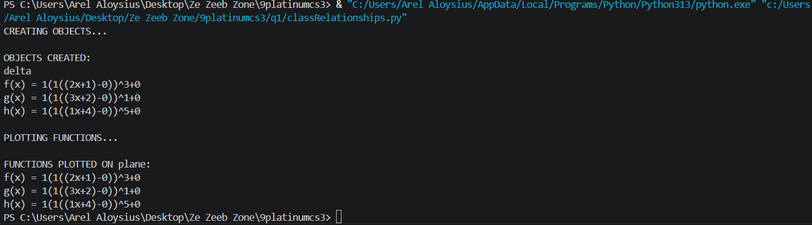
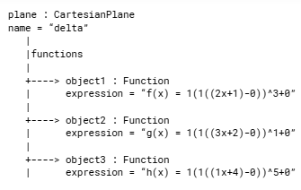

# Class Relationships: Association and Multiplicity
## Previous Work

[Part I - Classes and Objects](classObjectUML.md)
[Part II - Class Attributes and Methods](classAttributesMethods.md)

## Existing Class
Class: Function
Description: The class represents relations in a mathematical context that have only one output (y) assigned to each input (x), describing the properties (e.g., degree, leading coefficient, constant, and name) and actions (e.g, shifts, reflections, stretches, and compressions) pertained to its instances.

## New Related Class
Class: CartesianPlane
Description: The class represents a plane that may hold points pertained to coplanar functions.

These two classes are related as functions may be plotted on Cartesian planes, with one plane being able to hold multiple functions and different functions being able to be plotted on distinct planes.

## Association
Relationship: CartesianPlane contains Function
Explanation: A cartesian plane is functions are plotted on.

## Multiplicity
Multiplicity: CartesianPlane 1 -------------------- 0..* Function
Explanation: A cartesian plane can either have no functions plotted, have just one plotted, or multiple plotted. Thus, a cartesian plane can participate in a relationship with any number of functions.

## UML Class Diagram

## Python Implementation
[View Python Source](classRelationships.py)

## Test Run

## Object Relationship Diagram

## Analysis
### What is the association between your two classes? Explain the relationship using your actual system.
Class CartesianPlane contains Function. In the system, three objects are created under Function. Then, the objects are appended to a list that is an attribute of an object under CartesianPlane, thus relating the two classes such that Function is under CartesianPlane.

### What multiplicity did you choose, and why? Explain why 1:1, 1:0..*, or another multiplicity is appropriate.
I chose 1:0..* because of how functions and Cartesian planes mathematically work. On a Cartesian plane, a number of functions depending on the plotter can be plotted. This number can either be, zero, one, or higher.

### How did you implement the relationship in Python? Identify which attribute stores the related object or objects.
I implemented the relationship using an attribute of the variable type list under CartesianPlane. This was done so that objects under Function can then be stored in an object under CartesianPlane. The attribute's name is simply "functions."

### Why did you store an object reference instead of copying its data? Use one example from your implementation.
This was done to prove a true relationship between the two classes. If only the data was copied, there wouldn't be a true relationship between the two classes technically speaking as it does not directly copy over the objects themselves. If I instead used the data of objects under Function to be stored in the object under CartesianPlane, once the very objects are updated, the data stored in the object under CartesianPlane still stays the same. 

### If your relationship uses “many,” why is a list appropriate? Explain what the list actually contains.
A variable of type list is appropriate as it can store multiple data of different variable types in the case of Python. It may also be blank, taking on the form of "[]." In a relationship using "many," a list can store multiple objects under the same class in an object under another class.