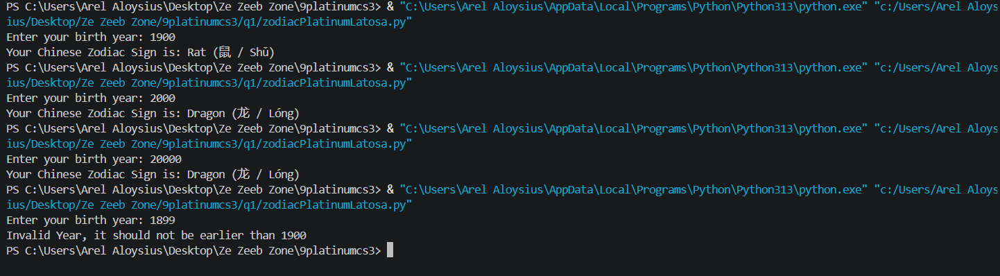

# Requirements
Create a zodiacSectionLN.py file.  This file will contain your solutions to the requirements below:

a. Ask the user to enter a year of birth.  The baseline year 1900.
b. Validate user input that it should not be earlier than 1900.
c. If the user enters an invalid year then display an appropriate message then stop or abort the program.

Example:
Enter your birth year: 1800
Invalid Year, it should not be earlier than 1900

d. Otherwise determine the chinese zodiac sign based on the following starting from 1900.  Note: A zodiac sign will recur after each 12 years.

i. Rat (鼠 / Shǔ)
ii. Ox (牛 / Niú)
iii. Tiger (虎 / Hǔ)
iv. Rabbit (兔 / Tù)
v. Dragon (龙 / Lóng)
vi. Snake (蛇 / Shé)
vii. Horse (马 / Mǎ)
viii. Goat (羊 / Yáng)
ix. Monkey (猴 / Hóu)
x. Rooster (鸡 / Jī)
xi. Dog (狗 / Gǒu)
xii. Pig (猪 / Zhū)

e. CONSIDER only the year of birth.

Example input and output:
Enter your birth year: 2000
Your Chinese Zodiac Sign is: Dragon (龙 / Lóng)

Test and Run your code before submitting.

Document this graded exercise in your Github portfolio and save it in zodiacSectionLN.md. This .md will include the requirements for this coding exercise, your actual code and a screenshot of your output. Update also your README.md file to have the link to your files.

Commit your changes in your github account and submit the live code link here and also your .git repository link.

Refer to Annex D for Code Exercise Rubrics for Grading found in khub.

# Code
zodiac = ["Rat (鼠 / Shǔ)", "Ox (牛 / Niú)", "Tiger (虎 / Hǔ)", "Rabbit (兔 / Tù)",
          "Dragon (龙 / Lóng)", "Snake (蛇 / Shé)", "Horse (马 / Mǎ)", "Goat (羊 / Yáng)",
          "Monkey (猴 / Hóu)", "Rooster (鸡 / Jī)", "Dog (狗 / Gǒu)", "Pig (猪 / Zhū)"]

year = int(input("Enter your birth year: "))

if year < 1900:
    print("Invalid Year, it should not be earlier than 1900")

else:
    print("Your Chinese Zodiac Sign is: ", end="", flush=True)
    print(zodiac[(year - 1900) % 12])

# Output
